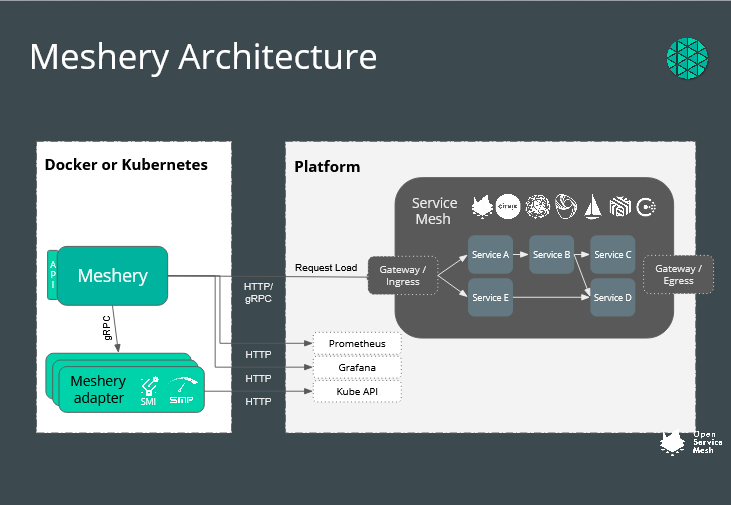

Meshery is written in Golang and leverages Go modules. The UI is built using React and Next.JS.
Your katacoda environment is already set up with stable versions of Golang, npm and node, which is all you need to run Meshery!

- Jump into the Meshery repository with:

`cd meshery`{{execute}}

- Install the UI dependencies:

`make setup-ui-libs`{{execute}}

The dependencies can take a few seconds to install. In the meanwhile, let's observe the Meshery architecture

- Build and export the UI:

`make build-ui`{{execute}}

While Meshery whips up its UI tailor-made for you, feel free to browse through this intro presentation:
<iframe src="https://docs.google.com/presentation/d/e/2PACX-1vSJdaOJ6MdmYQCyd2c3sbGsa9h7BVqauzBpdeVIKMpAh4eHoStLTMS8hmYJdzT0YTgXzS2chyrLPRzR/embed?start=true&loop=true&delayms=5000" frameborder="0" allow="accelerometer; autoplay; encrypted-media; gyroscope; picture-in-picture" allowfullscreen mozallowfullscreen="true" webkitallowfullscreen="true"></iframe>

