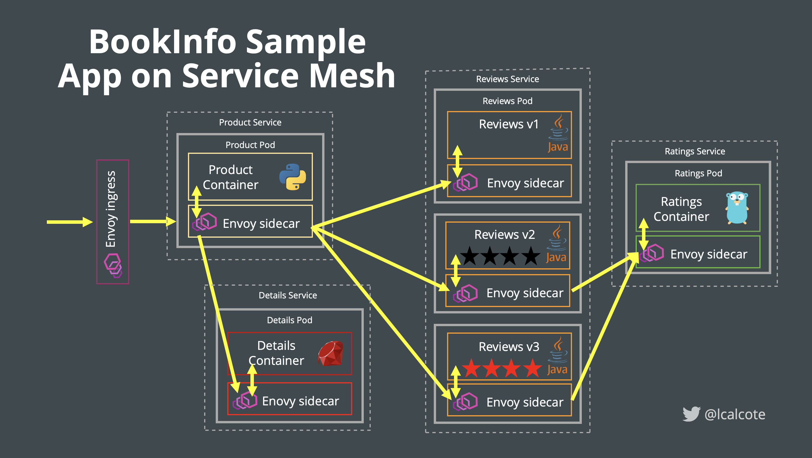

Let's deploy a sample application to run on Istio to get you better acquainted with the various feeatures of Istio and Meshery.

The [Bookinfo](https://istio.io/latest/docs/examples/bookinfo/) application is installed with the Istio package and can be deployed with a single click using Meshery. 
The application displays information about a book, similar to a single catalog entry of an online book store. Displayed on the page is a description of the book, book details (ISBN, number of pages, and so on), and a few book reviews. 
_The Bookinfo sample application has no dependency on Istio and can be deployed on any service mesh but for the purpose of this tutorial session, we will be using Istio._

The application uses `sidecars proxy`, which can be either manually or automatically injected into the pods. You may verify whether your Kubernetes deployment supports the `v1`,`v1beta1` or the `v1beta2` APIs by executing:
`kubectl api-versions | grep admissionregistration`{{execute}}

Let's verify that the sidecars proxy is up and running:
`kubectl -n istio-system get deployment -l istio=sidecar-injector`{{execute}}

Get a NamespaceSelector, which decides whether to run the webhook on an object based on whether the namespace for that object matches a defined group of objects (`selector`)
`kubectl get namespace -L istio-injection`{{execute}}

- Navigate to the **Istio Management** page on Meshery and enter `default` in the Namespace field.
- Select the `Bookinfo application` in the `Sample Application` drop down menu.

The virtual service and gateway needed to expose the BookInfo's productpage application in the default namespace has now been deployed.

Before continuing to the next step, perform these verification checks to ensure that your sample app is eady to be deployed: 

- Verify that the deployments are all in a state of AVAILABLE before continuing.
  `watch kubectl get deployment`{{execute}}
- Choose a service, for instance productpage, and view it's container configuration:
  `kubectl get po`{{execute}}
  `kubectl describe pod productpage-v1-....`{{execute}}
- Examine details of the services:
`kubectl describe svc productpage`{{execute}}

